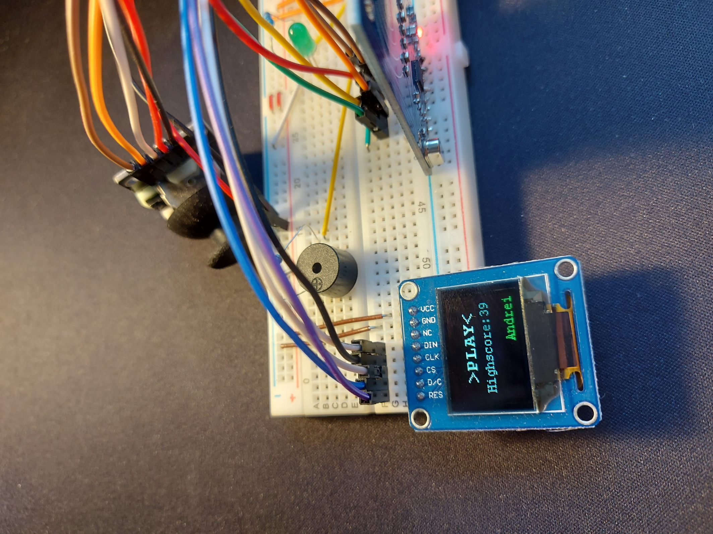
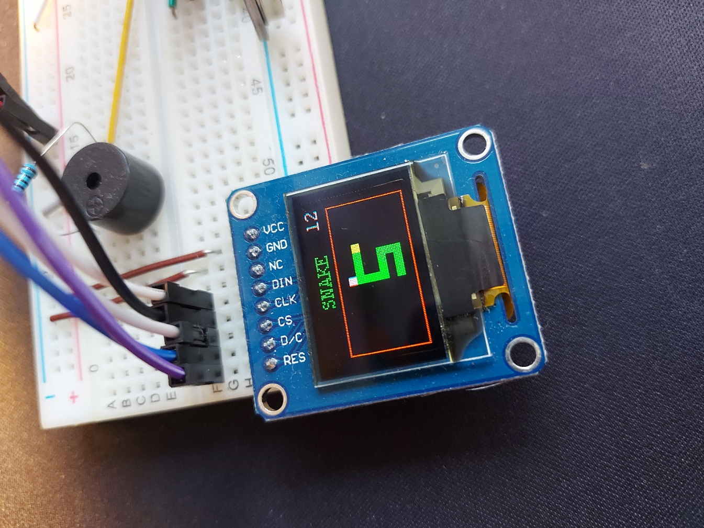

# Snake-Arduino-Game

The famous snake game running on Arduino :snake:

## Components

<ul>
    <li>Arduino Nano board</li>
    <li>RFID-RC522 card reader</li>
    <li>Waveshare 0.95 inch RGB OLED display</li>
    <li>Joystick</li>
    <li>Buzzer</li>
    <li>Rezistors</li>
    <li>LEDs</li>
    <li>Jumper Wires</li>
</ul>

## Usage

### Controls :joystick:

<ul>
    <li>Joystick-right: move the snake right</li>
    <li>Joystick-left: move the snake left</li>
    <li>Joystick-up: move the snake up</li>
    <li>Joystick-down: move the snake down</li>
    <li>Joystick-enter: enter</li>
</ul>

### Rules

<ul>
    <li>Initial length of the snake is 4</li>
    <li>The initial position of the snake is the same every time</li>
    <li>The position of every food is random in the same game and also in a new game</li>
    <li>If the snake touches himself or the boundaries the game is over</li>
    <li>Every time the snake eats a food he grows in size by one</li>
</ul>

After plugging the Arduino Nano to a power suply everything is set.
<br>
The player is ask to present his RFID card to the reader.
<br>
The game has multiple accounts each one having its username and personal high score.
<br>

<br>
After succesfully loging in with his card the user is displayed with its username, highscore and an option to start the game.

<br>
After the enter is pressed on the joystick the game starts


### Interesting programming insights

#### Random food for every new game :apple:

We need a way to generate random numbers with a different seed every time. To do this we use the **EEPROM** of the Arudino to store the last seed used for the random() function.
<br>
The code below extracts the last used, which is stored on two bytes, increments it by one, sets it as the seed for the current game and then store it again on the same address. A two bytes loop is more than enough for the player not to percieve any loop, the generation of the foods will loop every **65025** games.

```
  int firstByte = EEPROM.read(50);
  int secondByte = EEPROM.read(51);
  int seed = firstByte*8 + secondByte;
  randomSeed(seed);
  seed++;
  EEPROM.update(50, seed/255);
  EEPROM.update(51, seed%255);
```

<br>
EEPROM is also used to retrieve the highscore again stored on two bytes.
```
highScore = EEPROM.read(110)*255 + EEPROM.read(111);
```
