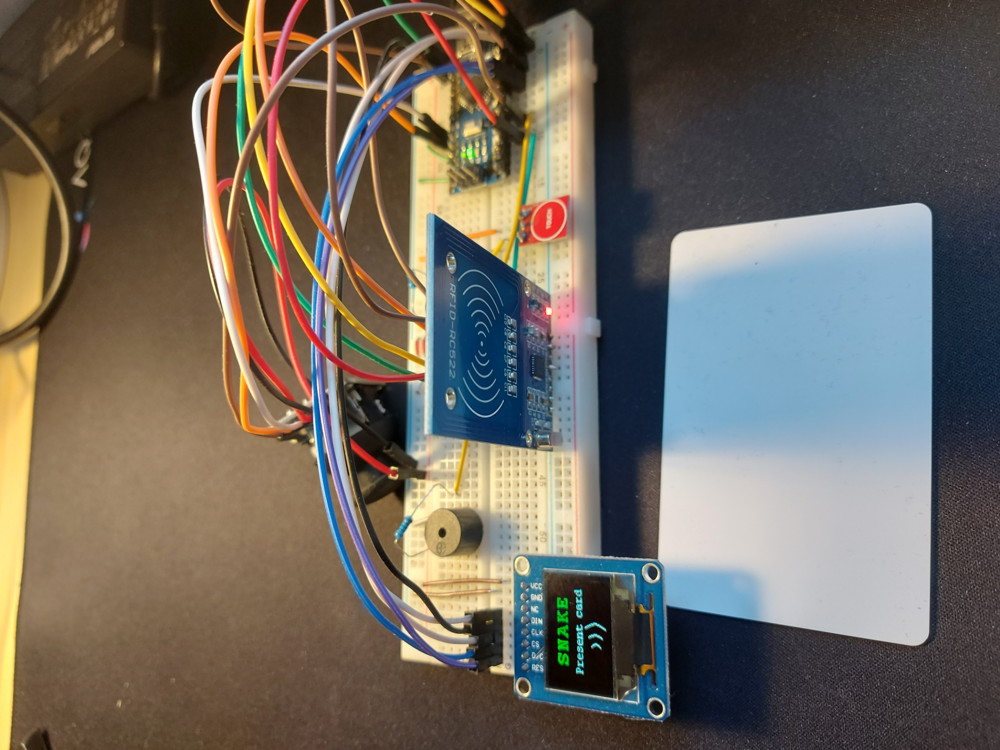

# Snake-Arduino-Game

The famous snake game running on Arduino

## Components

<ul>
    <li>Arduino Nano board</li>
    <li>RFID-RC522 card reader</li>
    <li>Waveshare 0.95 inch RGB OLED display</li>
    <li>Joystick</li>
    <li>Buzzer</li>
    <li>Rezistors</li>
    <li>LEDs</li>
    <li>Jumper Wires</li>
</ul>

## Usage

After plugging the Arduino Nano to a power suply everything is set.
 
The player is ask to present his RFID card to the reader.
 
The game has multiple accounts each one having its username and personal high score.

